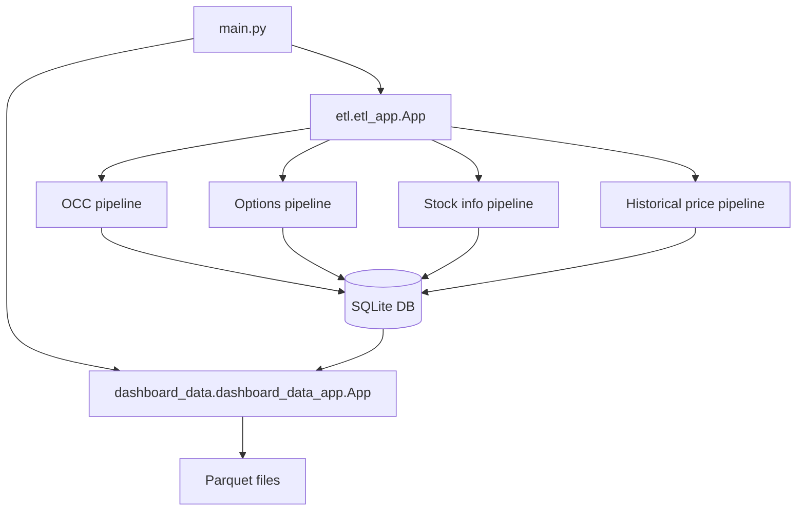

# Data Retrieval

`data_retrieval` is the market-data retrieval service for the larger application. It
fetches underlyings, option chains, stock metadata, and historical prices,
stores them in SQLite, then builds parquet datasets for the dashboard layer.

For the full project overview, dashboard documentation, and deployment runbook,
see `docs/`. For the package that enriches this package's parquet output with
Greeks, see `option_metrics/README.md`.

## Architecture



## What It Does

The main entry point runs two phases:

1. **ETL phase**
   - Downloads OCC underlyings.
   - Fetches aggregate OCC option volume.
   - Filters underlyings by volume threshold.
   - Fetches yfinance option chains, stock info, and historical prices.
   - Stops option loading when Yahoo has reset option quotes to zero.
   - Inserts SQLModel rows into SQLite.

2. **Dashboard data phase**
   - Reads SQLite tables into Polars DataFrames.
   - Builds dashboard-ready datasets.
   - Writes parquet files for downstream dashboard use.

## Runtime Data

By default, runtime data is stored in the sibling `data` folder at the project
root:

```text
data/
  DB.db
  parquet/
```

Inside Docker, this folder is mounted to:

```text
/app/data
```

The Dockerfile sets:

```text
DATA_DIR=/app/data
```

Full Docker Compose setup, Nginx, certificates, and systemd automation are
covered in `docs/setup.md`.

The dashboard phase writes these parquet files:

```text
data/parquet/
  stocks.parquet
  options_hist.parquet
  options_last.parquet
  stock_info.parquet
  stock_prices.parquet
```

## Configuration

Configuration lives in `config.py` and can be overridden with environment
variables.

| Variable | Default | Description |
| --- | --- | --- |
| `DATA_DIR` | `<project-root>/data` locally, `/app/data` in Docker | Base runtime data folder. |
| `DB_PATH` | `$DATA_DIR/DB.db` | SQLite database path. |
| `DASHBOARD_DATA_DIR` | `$DATA_DIR/parquet` | Parquet output folder. |
| `VOLUME_THRESHOLD` | `1000` | Minimum OCC option volume required for an underlying. |
| `VOLUME_CONCURRENCY` | `5` | Concurrent OCC volume requests. |
| `HISTORICAL_PERIOD` | `max` | yfinance history period used for first-time historical loads. |

## Data Model

Tables are defined as SQLModel schemas in `schemas/`.

| Table | Model | Purpose |
| --- | --- | --- |
| `stocks` | `Underlying` | Tradable stock or ETF underlyings. |
| `aggOptionVolume` | `OptionVolume` | Aggregate option volume by symbol and report date. |
| `options` | `OptionContract` | Option contract quotes and metadata. |
| `stockInfo` | `StockInfoItem` | yfinance stock metadata as key-value rows. |
| `stockPrices` | `HistoricalPrice` | Historical OHLCV stock prices. |

Tables are created automatically when the data retrieval service starts. Existing tables are not
dropped or migrated, so schema changes need a separate migration or a clean
database.

## External Data Sources

- **OCC market data**
  - Underlying download endpoint.
  - Option volume CSV endpoint.
- **yfinance**
  - Option expirations and chains.
  - Stock metadata.
  - Historical prices.

These sources are live external providers. Runs can fail or slow down because of
network issues, provider throttling, missing symbols, or upstream response
format changes.

### Option Quote Timing

Yahoo option-chain quotes can be reset to zero before the next trading session.
The data retrieval job should therefore run shortly after the U.S. equity
market close at 4:00 p.m. Eastern time. The dashboard calculates relative
option prices from option asks and the underlying stocks' close prices, so
loading options during the trading session can mix live option quotes with
previous close prices, while loading too late can capture zeroed option quotes.

The options pipeline protects the database from those reset quotes. It checks
the first symbol before requesting the remaining symbols; if every option chain
for that first symbol has zero or missing ask quotes, the options pipeline stops
without loading the rest of the symbol list. Individual expirations whose calls
and puts have no positive ask quotes are skipped before rows are transformed or
inserted.

## Setup

Create a virtual environment and install dependencies from the package
requirements file:

```bash
python -m venv .venv
source .venv/bin/activate
pip install -r data_retrieval/requirements.txt
```

## Running Locally

From project root:

```bash
mkdir -p data logs
DATA_DIR=data PYTHONPATH=data_retrieval python3 data_retrieval/main.py
```

## Running With Docker Compose

The root `compose.yaml` defines a `data_retrieval` service that builds this package and
mounts the shared data folder:

Run the data retrieval service with:

```bash
docker compose up data_retrieval
```

See `docs/setup.md` for the complete stack startup order and server deployment
flow.

## Testing

The default pytest configuration excludes live provider contract tests:

```bash
pytest
```

Run only this package's tests with:

```bash
pytest data_retrieval/tests
```

Run live OCC/yfinance contract tests explicitly with:

```bash
pytest -m contract
```

Contract tests require network access and working upstream providers.

## Operational Notes

- The entry point runs ETL first, then dashboard parquet generation.
- The OCC pipeline uses the previous two business days as the default report
  date and filters symbols by `VOLUME_THRESHOLD`.
- Run the options pipeline shortly after the U.S. equity market close so
  relative option prices are calculated from option asks and underlying close
  prices from the same market session.
- Symbol-oriented yfinance pipelines process randomized batches and sleep
  between requests to reduce provider pressure.
- A failure for one symbol is logged and does not stop the remaining symbols in
  the batch.
- Historical prices load the full configured `HISTORICAL_PERIOD` for new
  symbols, then incrementally fetch prices after the latest stored date.
- Parquet files are written through temporary files and atomically replaced.

## Package Layout

```text
data_retrieval/
  main.py                    # top-level entry point
  config.py                  # runtime configuration
  database.py                # SQLModel database helper
  schemas/                   # SQLModel table schemas
  etl/                       # data loading clients, services, pipelines
  dashboard_data/            # dashboard parquet generation
  Dockerfile                 # container image for the data retrieval service
```

## Developer Map

- `etl/client/` wraps external OCC and yfinance calls.
- `etl/transformers/` converts provider responses into schema objects.
- `etl/services/` contains shared ETL helpers such as concurrent volume fetches.
- `etl/pipelines/` coordinates each load step and database insert.
- `schemas/` defines SQLModel tables.
- `dashboard_data/repository.py` reads SQLite data into Polars.
- `dashboard_data/transformer.py` builds dashboard-ready DataFrames.
- `dashboard_data/writer.py` writes parquet outputs.

## Troubleshooting

- **`ModuleNotFoundError` when running from the repository root**: run with
  `PYTHONPATH=data_retrieval` or run `python main.py` from inside the
  package folder.
- **No parquet output appears**: confirm `DASHBOARD_DATA_DIR` or `DATA_DIR`
  points to a writable folder.
- **SQLite errors**: confirm the parent folder for `DB_PATH` exists and is
  writable.
- **Slow or partial yfinance data**: rerun later or lower the symbol set by
  raising `VOLUME_THRESHOLD`.
- **Contract tests fail**: check network access and upstream OCC/yfinance
  availability before assuming local code is broken.
