# Dashboard

The Dash app provides these top-level views:

- Options, with nested views for option prices and option metrics.
- Stock info.
- Stock prices.

The screenshots below were captured from a local dashboard run using the parquet
bundle in `data/parquet`.

## Option Prices

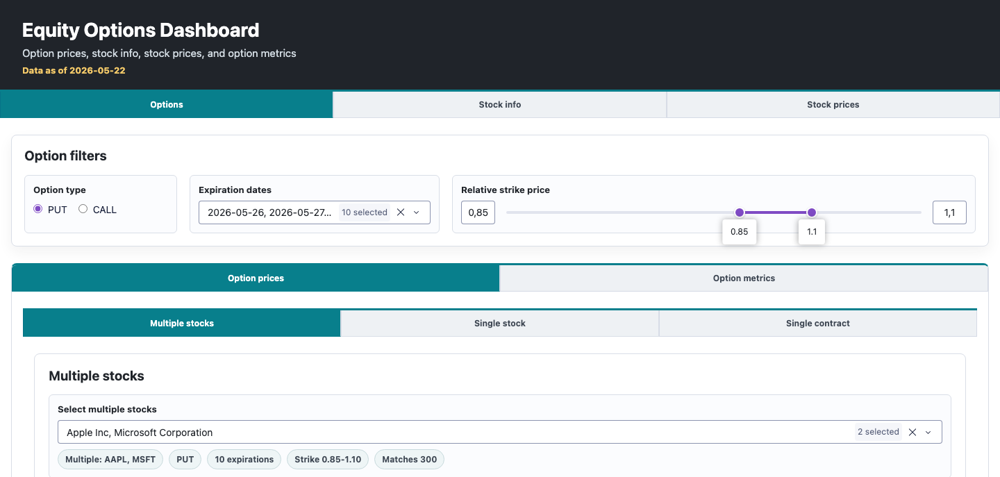

The option price workflow includes multiple-stock scatter charts, single-stock
heatmaps, and a selected-contract time series.

### Multiple Stocks

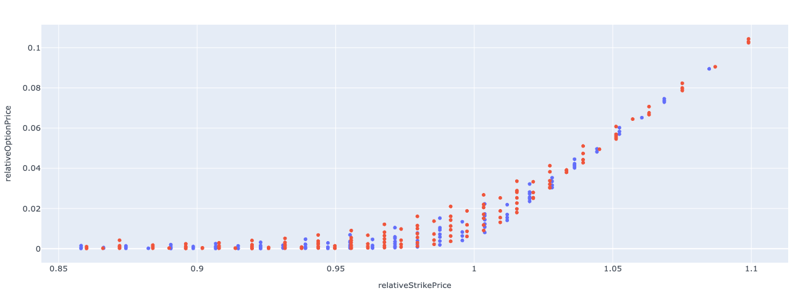

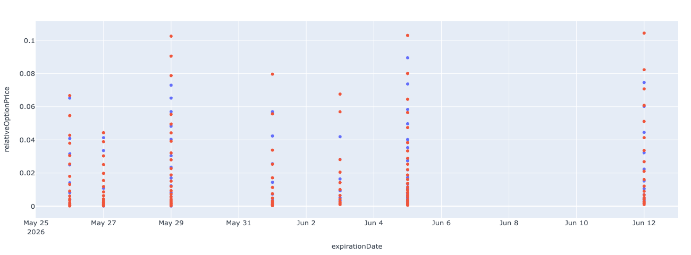

### Single Stock

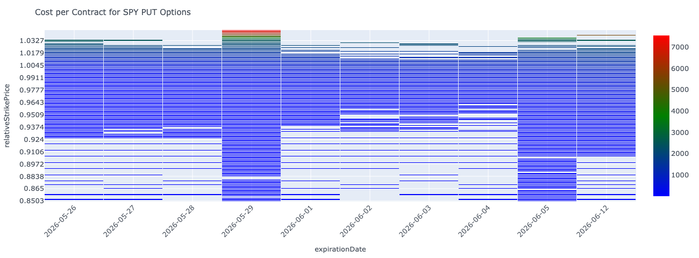

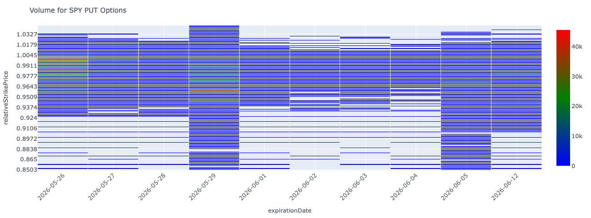

### Single Contract

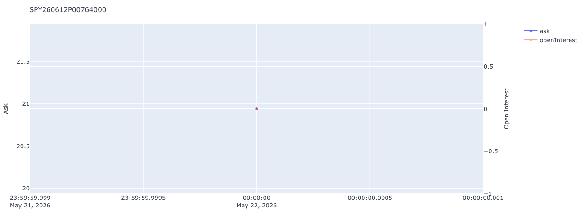

## Option Metrics

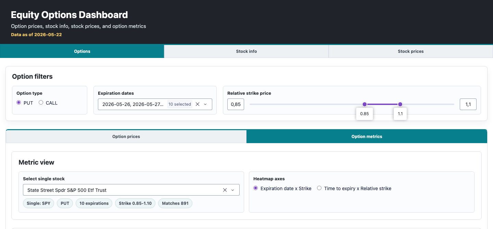

The option metrics view shows heatmaps for implied volatility and Greeks. The
implied-volatility chart below is representative of the metric chart layout.

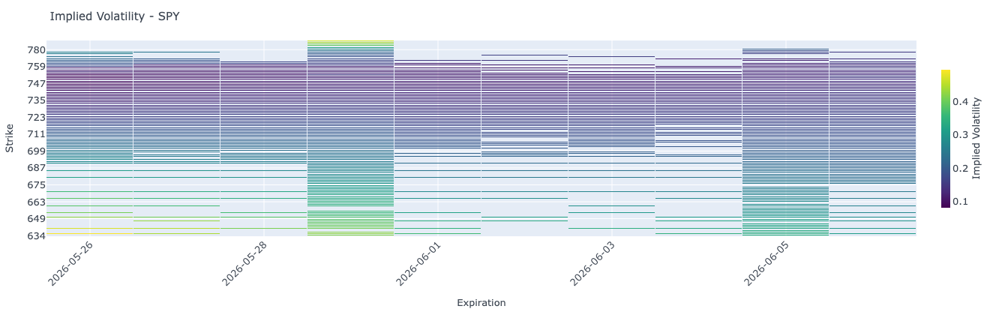

## Stock Info

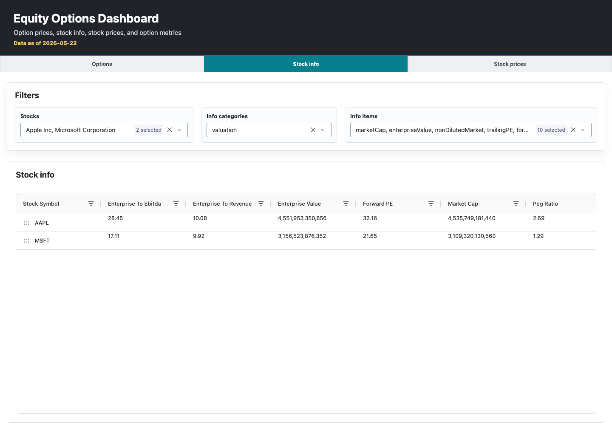

## Stock Prices

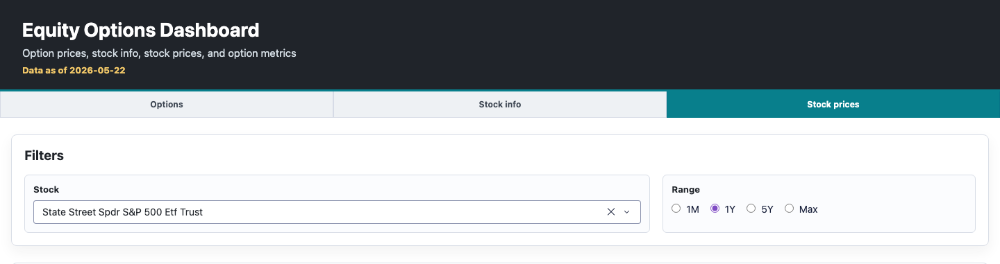

The stock price view compares price history and volume for the selected
underlying.

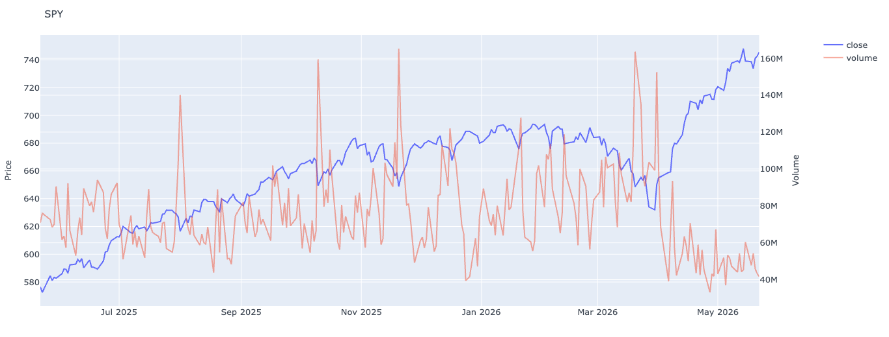

## Startup Status

When required parquet files are missing, the app starts with a status page
instead of registering the full dashboard.

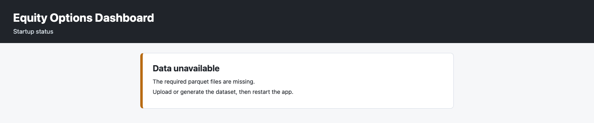
